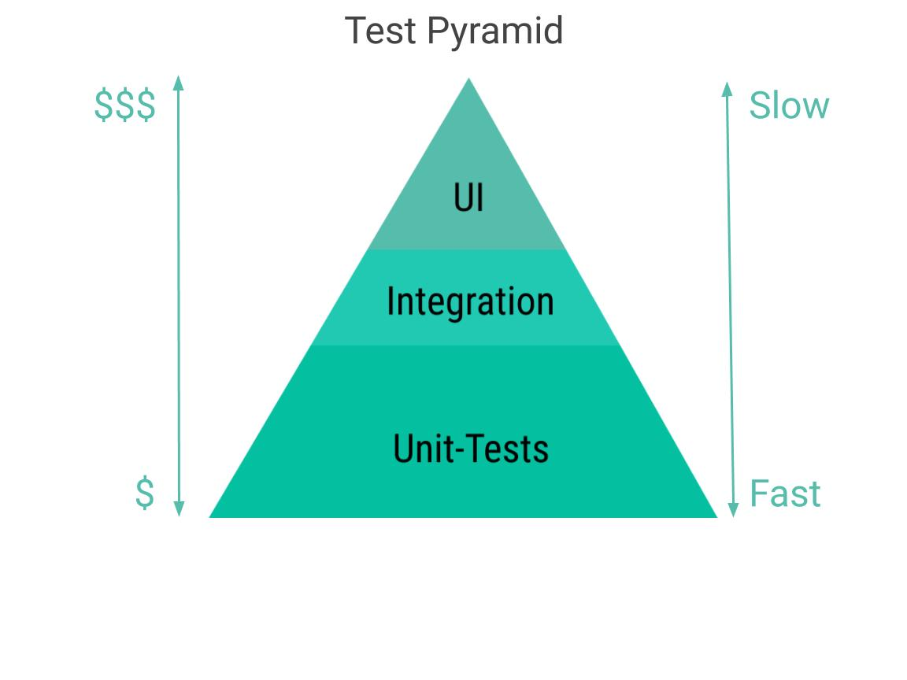
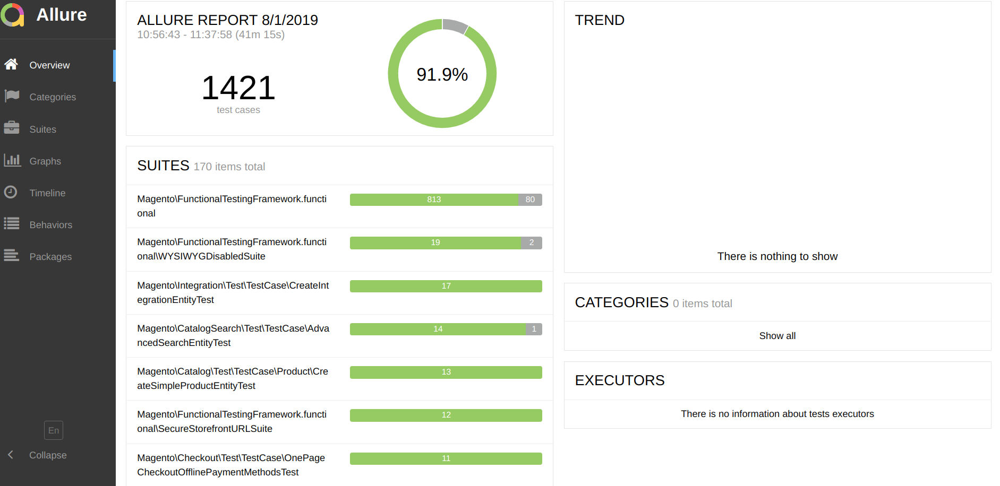

For every Developer, it is essential to make sure that code works. Nobody likes if the live or staging system has a fatal error or whole page/website doesn't work anymore after a deployment.

In this blog post, I will share my learnings from Magento Community Team and my experience what I did in the past.
For me, they are four crucial pillars to make sure you get fewer blocker tickets for your new Module/Projects. The four areas are clean code, testing, and automation as well as continuous process improvement.

### Clean Code

In my experience, Clean Code helps to reduce the cost of maintaining, writing tests, on board developers to the project.

My favorite quote from Martin Fowler is:

> Any fool can write code that a computer can understand. Good programmers write code that humans can understand.

The means any developer should write for code that humans can understand.
Usually, Developers read more code than we write in the average development/lifetime of a project.

This short example from a [Clean Code Book](https://learning.oreilly.com/library/view/clean-code/9780136083238/) shows the value of Clean Code for new Implementations.

**Code before Refactoring:**

```php:title=Board.php
class Board // which board ?
{
    /**
     * Demo data
     */
    private $theList = [
        [0 => 4],
        [0 => 2]
    ];

    public function getThem() // what means getThem ?
    {
        $list = [];
        foreach ($this->theList as $x) { // what is theList there ?
            if ($x[0] === 4) { // what 0 and 4 there ?
                $list[] = $x;
            }
        }

        return $list; // list of what ?
    }
}
```

**Code after Refactoring:**

```php:title=GameBoard.php
class GameBoard
{
    private const STATUS_KEY = 0;
    private const FLAGGED = 4;

    /**
     * Demo data
     */
    private $cells = [
        [self::STATUS_KEY => 4],
        [self::STATUS_KEY => 2]
    ];

    /**
     * Returns all flagged game board cells.
     * @return array
     */
    public function getFlaggedCells()
    {
        $flaggedCells = [];
        foreach ($this->cells as $cell) {
            if ($cell[self::STATUS_KEY] === self::FLAGGED) {
                $flaggedCells[] = $cell;
            }
        }
        return $flaggedCells;
    }
}

```

**Clean Code** is an excellent book that all programmers should read,

The rules from Clean Code Book can apply to your old code by refactoring.
I recommend reducing the technical debt with your sprint Tickets as subtasks. Estimated these subtasks and define a benefit for your team or customer.

**A benefit can be:**

<Callout>
  We reduce the change time for the next change on this feature.
</Callout>

Before you refactor you should cover your Implementation with Intitragtionstests. In an existing framework like Magento, it is sometimes not easy to apply rules from a Book. With Magento 2 it is more comfortable to build clean code. You can use features like Dependency Injection. In an example, [Magento Inventory (MSI)](https://github.com/magento/inventory) already use Pattern like Command Query Responsibility Segregation.

<Callout>
  <p>
    <strong>Read Tip:</strong> Object Design Style Guide by Matthias Noback
  </p>
  <p class="py-2">
    Object Design Style Guide is a good foundation book. Applying best practices
    for object design means that your code will be easy to read, write, and
    maintain. All Code Examples in this book are in a generalized
    object-oriented programming language.{' '}
  </p>
  <p>
    Link:{' '}
    <a
      href="https://www.manning.com/books/object-design-style-guide"
      target="_blank"
      rel="nofollow noopener noreferrer"
    >
      https://www.manning.com/books/object-design-style-guide
    </a>
  </p>
</Callout>

<p></p>

#### Backward compatible development

If you develop Module for the Magento Market place. It is important to know how to develop backward compatible. I strongly recommend following the rules of this guideline:
**https://devdocs.magento.com/guides/v2.3/contributor-guide/backward-compatible-development/**

### Testing

For production-ready software, it is required to have tests that verify the software behaves as expected. You can do to this with myriads of manual software testers. But the cost and maintains are expansive for manual software testing also the feedback is slow.
In the IBM research "Minimizing Code Defects to Improve Software Quality and Lower Development Costs" is a good statement:

The costs of discovering defects after release are signed up to 30 times more than if you catch them in the design and architectural phase.


This statement leads me to we need different types of automated tests to reduce the feedback time. But you as a developer don't like run tests that take hours before you can push. To split test Mike Cohn came up with a concept "Test Pyramid" in his book [_Succeeding with Agile_](https://www.oreilly.com/library/view/succeeding-with-agile/9780321660534/) .

If you like to know more about Test Pyramid you should read :

**[The Practical Test Pyramid](https://martinfowler.com/articles/practical-test-pyramid.html)**.



In the ground we have Unit-Tests it followed by Integration tests and User Interface test at the top.

#### Unit tests

Unit tests are relatively easy to create also quick to run. We can use them to achieve good coverage and detect most errors at a very early stage of development. Unit-Test should run before we commit your code the version. Ideally, they even develop with TDD or follow the principles of Clean Code.

#### Integration tests

Integration tests can be automated relatively well these tests required an installed Magento with Database. An install can take time should not run locally.

Documentation for setup and running integrations test with Magento 2.

https://devdocs.magento.com/guides/v2.3/test/integration/integration_test_execution.html

#### User Interface (UI) tests

UI tests can be complex and tricky to run automatically. Also, the automation maintenance is very time-intensive, therefore you should consider well if automation makes sense. Tools like Selenium or Cypress I use by many projects. For UI Test I can recommend evaluated two tools and find the best fit for your project.

#### Mutations testing

With the help of the [infection library](https://github.com/infection/infection), it is possible to check how resilient the test suite is. The library runs the units tests on the manipulated code to calculate the Mutation Score Indicator.

**Attention** this step is an extension but should be done on the CI-System because it can take a long time.

#### Smoke Testing

Manuelle Testing is expansive but covers some complex it can be to difficult by automation. I recommend collecting a test-case step by step in a system currently we using currently only google docs. Better it is to use as test case management software and run later by automated tests.

#### Coding Standards

Most developer teams define programming style (Coding Standard). Coding standard allows getting better understandable code. That can reduce the on boarding time for new developers. The Coding Standard Tools (PHP_CodeSniffer) should also run on commit via git hooks.

### Conclusion

- Learn to write tests and use Test Driven Development
- Tests are not free but very helpful
- Code Coverage only shows what has not yet been executed
- Use Code Coverage to find gaps in the test-suite
- Bugs in Production are extremely expensive
- Find the errors best during development

#### Allure Report



Allure Framework is a test report tool that shows a representation of performed tests. The representation can be much essential to get an overview of failing tests.

**Documentation can be found at:**

**https://devdocs.magento.com/mftf/docs/reporting.html**

### Automation

With automation, it is possible to save time and money over the project time. For setup, you will have minor one-time expenses. I think over project live time it is a good investment in quality. With CI-System like [Gitlab](https://about.gitlab.com/), it is possible to set up automatic reviews. Automatic reviews can reduce the time and rejection rate for review.

To get best from of automation we need checks for before we push. To setup git hooks I recommend tools like [GrumPHP](https://github.com/) or [Captian Hook.](https://github.com/CaptainHookPhp/captainhook) The following tests should run before any push:

- Commit Message
- [Coding Standard](https://github.com/magento/magento-coding-standard)
- Unit Tests

<Callout>

<p>
  <strong>Read Tip:</strong> How to Write a Git Commit Message
</p>

<p class="py-2">A Blog post about seven rules for a great Git commit message</p>
<p>Link: <a href="https://chris.beams.io/posts/git-commit/" target="_blank" rel="nofollow noopener noreferrer">https://chris.beams.io/posts/git-commit/</a></p>
</Callout>

### Continuous Improvement

Continuous Improvement is a foundational principle agile.
In the agile manifesto is defined with:

> At regular intervals, the team reflects on how
>
> to become more effective, then tunes and adjusts
>
> its behavior accordingly.

That suggests to have regular meeting with all member to speak about:

- What was great? - let's keep it
- What is not working? - find ways do it rightly
- What we should to more?

Not only is the continuous improvement necessary for the team. There should also be time for self-improvement to getting a better engineer.

But for me there is more programming is a kind of mastery, when you train, you get better. You can learn the foundations by reading books and blog entries, the basics help you understand patterns. On the other hand, training is essential coding kata are the choice for practice. To detect arias to improvement help to use peer feedback or mentoring if you are more a junior developer.
