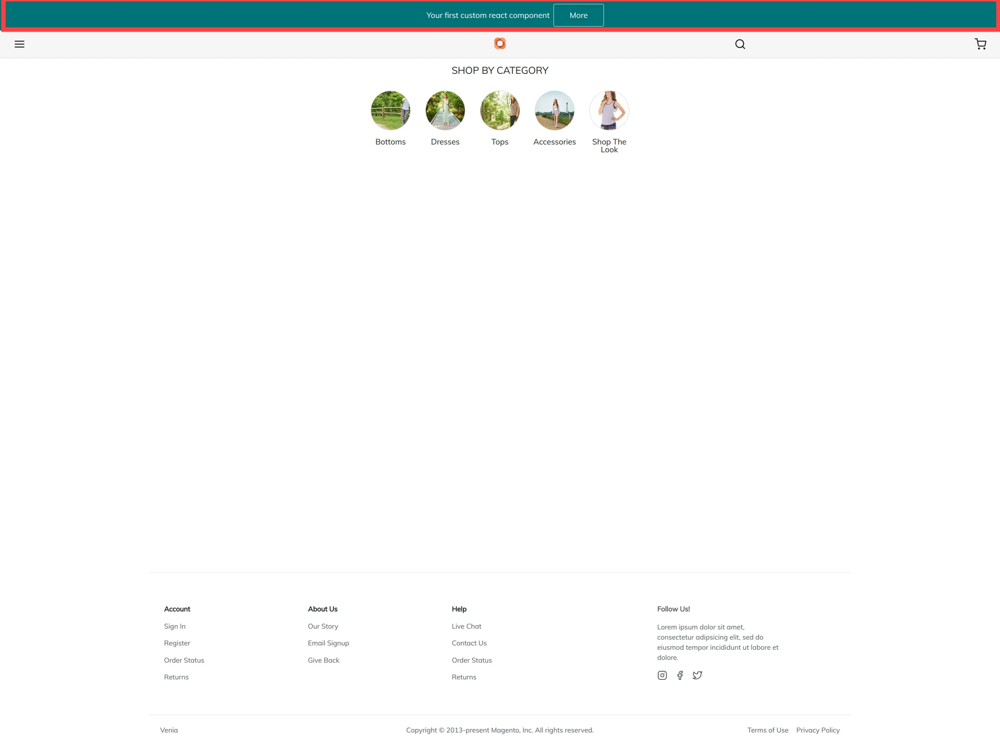

The **7.0** release improves on the extensibility framework. I want to prove if we can already build a real PWA extension or where we run in limitation.
This blogpost contains two parts. The first part is about the technical strategies behind the Extensibility Apis. In the second part, we will write a small extension.

## Technical strategies

The new extensibility Apis allows extending Build pack, Peregrine, and Venia UI library components. The main goal is developers can make changes in storefront projects or standalone extensions without duplicating or maintaining the PWA-Studio code. The PageBuilder is integrated via targets. It is the first Magento Content plugin. Also, it is an excellent example of your plugins.
For replacing or extend already existing ui components, we need a workaround currently. Replacing a part can be dangerous. It is not a compound change, so if two extensions both want to replace the same file, it can lead to errors. Currently, the Core Team doesn't want to support a fallback structure by default.
From my perspective, we need a way how a plugin can register its new components to already existing ui components. PWA Studio packages should declare which of their ui-components are safe to replace and make them replaceable. A reliable replacement strategy will help that vendors can build Standalone Marketplace Extensions.

### Venia UI extension points
Currently it is allowed to add new routs or create a new `richContentRenderers` to create new
blog plugin based on CMS like NEOS. The `richContentRenderers` are used to integrated the Magento
Page Builder Plugin in PWA Studio.

**Dokumentation Link:**
https://github.com/magento/pwa-studio/blob/release/7.0/packages/venia-ui/lib/targets/venia-ui-declare.js

### Peregrine extension points
We can now wrap any individual Peregrine talons
when Peregrine talons are invoked, and/or to modify the behavior and output of those talons.
Like the around plugin concept knowen as interceptor pattern of Magento.

```javascript
targets.of('@magento/peregrine').talons.tap(talons => {
    talons.App.useApp.wrapWith('./log-wrapper');
})
```

```javascript:title=log-wrapper.js
export default function wrapUseApp(original) {
    return function useApp(...args) {
        console.log('calling useApp with', ...args);
        return original(...args);
    }
}
```

### Build pack extension points

This extension points is based on the [Webpack Compiler Hooks](https://webpack.js.org/api/compiler-hooks/).
This the Webpack API is very well documented and often used to build plugins.

** [Dokumentation Link](https://github.com/magento/pwa-studio/blob/release/7.0/packages/peregrine/lib/targets/peregrine-declare.js) **

## How to create a PWA Studio Extension

In this tutorial, we create a new Info TopBar component.



**The story contains the following acceptance criteria:**

As a Customer, I want to show a TopBar to inform customers about holidays and longer delivery time.

UAK:
- TopBar Informs customers
- Topbar styled with customer brand colors.

**Command to create a new Project:**

```bash
yarn create @magento/pwa
```


**Create SSL Cerficate:**

```bash
cd <your_pwa_studio>
yarn install
yarn buildpack create-custom-origin ./
```

**Create your own Module**
```bash
cd ../
mkdir -p larsroettig/top-bar-plugin
cd larsroettig/top-bar-plugin
```

<Callout type={'warning'}>
<b>Important:</b>

All esModules need a main entry file to get be loaded which can be the `index.js` in the main directory.
Alternatively we can define the main file in the `package.json` via <br/> `{"main": "./lib/components/TopBar/index.js"}`.
More Information you can find here https://hacks.mozilla.org/2018/03/es-modules-a-cartoon-deep-dive/
</Callout>

```javascript:title=package.json
{
  "name": "@larsroettig/top-bar-plugin",
  "version": "1.0.0",
  "description": "",
  "author": "Lars Roettig <l.roettig@techdivision.com>",
  "license": "MIT",
  "main": "./lib/components/TopBar/index.js"
  "pwa-studio": {
    "targets": {
      "intercept": "intercept.js"
    }
  },
  "peerDependencies": {
    "@magento/pwa-buildpack": "*",
    "@magento/venia-ui": "*",
    "react": "~16.9.0",
    "react-router-dom": "~5.1.0"
  }
}
```

```javascript:title=intercept.js {12}
const moduleOverridePlugin = require('./moduleOverrideWebpackPlugin');
const componentOverrideMapping = {
    '@magento/venia-ui/lib/components/Main/main.js': './lib/overwrites/components/Main/main.js',
};

module.exports = targets => {
    targets.of('@magento/pwa-buildpack').specialFeatures.tap(flags => {
         /**
          *  Wee need to actived esModules and cssModules to allow build pack to load our extension
          * {@link https://magento.github.io/pwa-studio/pwa-buildpack/reference/configure-webpack/#special-flags}.
          */
        flags[targets.name] = {esModules: true, cssModules: true};
    });

    targets.of('@magento/pwa-buildpack').webpackCompiler.tap(compiler => {
        // registers our own overwrite plugin for webpack
         new moduleOverridePlugin(componentOverrideMapping).apply(compiler);
    })
}
```

#### Create Webpack Overwrite Plugin

The Webpack has ships [NormalModuleReplacementPlugin](https://webpack.js.org/plugins/normal-module-replacement-plugin/) allows you to replace resources that match resourceRegExp with newResource.
This very helpful for replacing one file. But I want to show you how we can write our Plugin very essay.
From my point of view, this plugin has a better developer experience, because we can overwrite multiple files and don't need to use a regex.

```javascript:title=moduleOverrideWebpackPlugin.js
const path = require('path');
const glob = require('glob');

module.exports = class NormalModuleOverridePlugin {
  constructor(moduleOverrideMap) {
    this.name = 'NormalModuleOverridePlugin';
    this.moduleOverrideMap = moduleOverrideMap;
  }

  requireResolveIfCan(id, options = undefined) {
    try {
      return require.resolve(id, options);
    } catch (e) {
      return undefined;
    }
  }
  resolveModulePath(context, request) {
    const filePathWithoutExtension = path.resolve(context, request);
    const files = glob.sync(`${filePathWithoutExtension}@(|.*)`);
    if (files.length === 0) {
      throw new Error(`There is no file '${filePathWithoutExtension}'`);
    }
    if (files.length > 1) {
      throw new Error(
        `There is more than one file '${filePathWithoutExtension}'`
      );
    }

    return require.resolve(files[0]);
  }

  resolveModuleOverrideMap(context, map) {
    return Object.keys(map).reduce(
      (result, x) => ({
        ...result,
        [require.resolve(x)]:
          this.requireResolveIfCan(map[x]) ||
          this.resolveModulePath(context, map[x]),
      }),
      {}
    );
  }

  apply(compiler) {
    if (Object.keys(this.moduleOverrideMap).length === 0) {
      return;
    }

    const moduleMap = this.resolveModuleOverrideMap(
      compiler.context,
      this.moduleOverrideMap
    );

    compiler.hooks.normalModuleFactory.tap(this.name, (nmf) => {
      nmf.hooks.beforeResolve.tap(this.name, (resolve) => {
        if (!resolve) {
          return;
        }

        const moduleToReplace = this.requireResolveIfCan(resolve.request, {
          paths: [resolve.context],
        });
        if (moduleToReplace && moduleMap[moduleToReplace]) {
          resolve.request = moduleMap[moduleToReplace];
        }

        return resolve;
      });
    });
  }
};
```


#### Create your own PWA Component

```css:title=lib/components/TopBar/topbar.css
.root {
    background-color: rgb(var(--venia-teal));
    padding: 0.5rem;
    color: #fff;
    display: grid;
    grid-template-columns: 25% 25%;
    justify-content: center;
    align-items: center;
}

.moreText {
    text-align: end;
}

.moreButton {
    color: #fff;
    margin-left: 0.5rem;
    display: inline-block;
    padding: 0.75rem 2rem;
    border: 1px solid #fff;
    border-radius: 3px;
    outline: none;
}
```

```javascript:title=lib/components/TopBar/topbar.js
import React from 'react';
import {mergeClasses} from '@magento/venia-ui/lib/classify';
import Button from '@magento/venia-ui/lib/components/Button/button';
import defaultClasses from './topbar.css';

const TopBar = () => {
    const classes = mergeClasses(defaultClasses);

    return (
        <div className={classes.root}>
            <div className={classes.moreText}> Your first custom react component</div>
            <div>
                <Button className={classes.moreButton}>
                    {'More'}
                </Button>
            </div>
        </div>
    )
};

export default TopBar;
```

```javascript:title=lib/components/TopBar/index.js
export { default } from './topbar';
```

#### Replace Main PWA Component

``` bash
mkdir lib/overwrites/components/Main
cp node_modules/@magento/venia-ui/lib/components/Main/main.js lib/overwrites/components/Main/main.js
```

```javascript:title=lib/overwrites/components/Main/main.js {8,9,10,23}
import React from 'react';
import {bool, shape, string} from 'prop-types';
import {useScrollLock} from '@magento/peregrine';

import {mergeClasses} from '@magento/venia-ui/lib/classify';

import Footer from '@magento/venia-ui/lib/components/Footer';
import Header from '@magento/venia-ui/lib/components/Header';
import defaultClasses from '@magento/venia-ui/lib/components/Main/main.css';
import TopBar from '@larsroettig/top-bar-plugin/lib/components/TopBar';

const Main = props => {
    const {children, isMasked} = props;
    const classes = mergeClasses(defaultClasses, props.classes);

    const rootClass = isMasked ? classes.root_masked : classes.root;
    const pageClass = isMasked ? classes.page_masked : classes.page;

    useScrollLock(isMasked);

    return (
        <main className={rootClass}>
        <TopBar/>
        <Header/>
        <div className={pageClass}>{children}</div>
        <Footer/>
        </main>
);
};

export default Main;

Main.propTypes = {
    classes: shape({
        page: string,
        page_masked: string,
        root: string,
        root_masked: string
    }),
    isMasked: bool
};
```

Open `cd <your_pwa_studio>/package.json` add following line for lokal testing later you install your
extension via `yarn install --force`

```bash
"devDependencies": {
    "@larsroettig/top-bar-plugin": "file:<file_path>/larsroettig/top-bar-plugin",
 }
```


<Callout>
<b>The Final Github Repo you can find here:
<br/>
  <a href="https://github.com/larsroettig/pwa-studio-component-override">
      Github Repo
  </a>
</b>

</Callout>

### How do can add static routs as Extension

<iframe
    width="100%"
    height="500"
    src="https://www.youtube-nocookie.com/embed/5fTIYrGZH0M"
    frameborder="0"
    allow="autoplay; encrypted-media"
    allowfullscreen
></iframe>


### Tipps

<Callout>
If you do not need a Standalone Extension, you can also the Plugin from Fooman is build to overwrite files in scaffolded PWA.
<br/>
<b>
  <a href="https://github.com/fooman/venia-ui-override-resolver">
      Github Repo
  </a>
</b>
</Callout>
